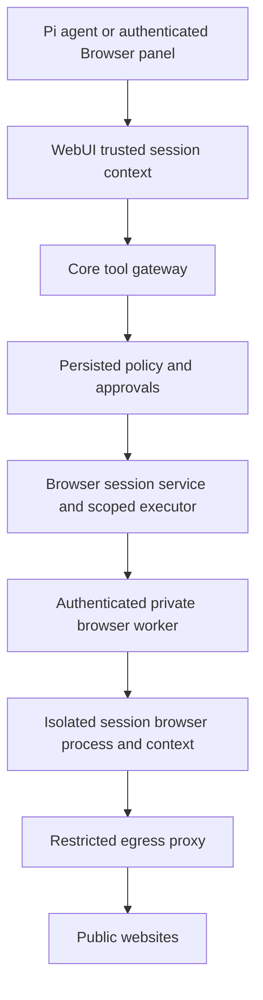

# Agent browser integration plan

Status: proposal only; no browser implementation or UI changes are included.
Inspection date: 2026-10-04. Paths below are relative to the repository root.

## 1. Decision and scope

**Recommendation:** run an open-source Playwright driver with Chromium in a private browser-worker sidecar beside the WebUI server. Keep Subpolar/Pi as the agent and permission authority. Implement the existing `BrowserPort` through a narrow authenticated worker protocol, not through a public CDP endpoint or a general-purpose browser agent API.

The target experience is an agent-operated browser: the agent can inspect rendered pages and screenshots, navigate tabs, click elements, type, scroll, select options, and complete approved workflows. The user's Grok Bot reference describes desired behavior, not a verified claim about Grok's internal implementation. A read-only page fetcher is not the final product.

**Persistent profiles for selected websites are a product requirement**, alongside an ephemeral default. Users should be able to log in once, retain the site's supported authentication state across application/browser-worker restarts, and explicitly authorize an agent to reuse that profile. Profile persistence does not itself grant agent access to the site or permission to perform actions.

Start implementation with the nine existing read/navigation operations, but deliver typed interaction tools and persistent website profiles as part of the target browser rather than leaving them as optional features. Browser Use is a reasonable later autonomous-planning option, but only if every proposed action can be intercepted and admitted by Subpolar before execution. Do not approve an entire natural-language task and then let a second agent operate unrestricted.

“Free” here means no mandatory hosted-browser subscription or proprietary browser-agent service. Hardware, bandwidth, maintenance, and any paid model inference still cost money. The first phase needs no additional model: the existing Subpolar agent chooses actions. A fully local model is a separate deployment choice, not a performance guarantee.

## 2. Verified repository facts

These are observed implementation facts, not promises about a future live engine.

| Area | Observed behavior and source |
| --- | --- |
| Composition | `@webui/server/index.ts` exports the tool gateway, approval flow, network policy, gateway credentials, and browser module. Browser integration belongs in the host/executor layer, not in the persistence-neutral core. |
| Browser seam | `@webui/server/browser/contracts.ts` defines `BrowserPort`: `open`, `navigate`, `back`, `forward`, `tabs`, `read`, `find`, `screenshot`, `wait`. `configureBrowserPort()` supplies a process-level default. Without injection, `UnavailableBrowserPort` throws `BROWSER_UNAVAILABLE`. `FakeBrowserPort` fetches pages through network policy; it is not a live JavaScript browser. |
| Persistence | `browser/schema.ts` defines `browser_sessions` and `browser_audit`, with owner and scope indexes. Session records carry optional project/Pi-session/task IDs, lifecycle, tabs, current URL, and limits. `BrowserSessionService` checks owner and exact equality of project/session/task scopes. Creation verifies referenced scope ownership. |
| Current API | `server/routes/browser.ts` provides authenticated session create/list/get/close and audit reads under `/api/browser/sessions`. Those routes call the session service, not the tool gateway. Creation currently writes metadata; it does not launch a browser. |
| Tools | `server/application/tools/tools.ts` seeds `browser/open`, `browser/navigate`, `browser/back`, `browser/forward`, `browser/tabs`, `browser/read`, `browser/find`, `browser/screenshot`, `browser/wait`. They use the internal adapter, target `browser`, require `browserSessionId`, and are currently marked read-risk without default approval. Execution requires an owned Pi tool session. |
| Permission authority | `createCoreToolGateway()` resolves the current agent and project configuration, database tool policies, profile rules, context mode, permission override, and approval mode. Browser tools also require `effective.policies.browser === true`. Mutation policy groups are restricted for plan/reviewer templates. Disabled tools/rules, explicit deny, override `none`, and approval mode `deny` are checked before permissive overrides. |
| Override semantics | `ask` can require approval; `allow_all` suppresses ordinary approval and can bypass lack of an explicit non-master allow. It does **not** bypass the earlier deny or browser-capability checks. `requiresManualApproval()` takes precedence over `allow_all` in `shouldRequireAgentToolApproval()`. A newly registered mutating browser tool would not automatically acquire that manual precedence. |
| Agent route | `@webui/subpolar/extensions/tool-routing.ts` exposes discovery and `subpolar-tools` calls through the core gateway, waits for approvals, and blocks tool names outside the central router. The in-process execution context includes owner/session/agent but does not currently include `projectId`. |
| HTTP/CLI route | `server/routes/tools.ts` verifies persisted session ownership and gateway credential scopes, derives the project from that session, and rejects a requested permission override that differs from persisted policy. It emits `permission.asked` and returns HTTP 202 for approval-required calls. `packages/subpolar-tools/src/cli.ts` calls this route and exposes approval listing/rejection. |
| Tools package | `packages/subpolar-tools/src/index.ts` supports multiple adapters including browser, input validation, injected policy/context/persistence, and registry-issued authorization objects checked by identity before invocation. This package boundary is distinct from the active WebUI core gateway; its objects are not cross-process worker credentials. |
| Other permission tooling | `@webui/subpolar/extensions/permissions.ts` implements local JSON `deny`/`manual`/`auto` rules, compatibility mappings, an optional model reviewer, and a master bypass. This is a separate permission mechanism, not a substitute for server-side database policy. |
| Network | `server/core/network-policy.ts`, documented in `docs/network-policy.md`, supports DNS-validated, address-pinned fetches and redirect checks. A Chromium network stack will not automatically inherit those protections. |
| Limits and audit | Current defaults are 15 s timeout, 4 MiB page bytes, 128 KiB text, eight tabs, three redirects. The service truncates text and persists tab metadata without text. Browser-specific audit sanitizes details/URLs; this does not establish that all generic gateway audits, transcripts, or screenshots have equivalent content handling. |
| Tests | `server/tests/browser.test.ts` contains fake-runtime tests for ownership, exact scope matching, lifecycle, UTF-8 limits, redaction, private redirects, tab limits, and unavailable runtime. These were inspected, not executed for this documentation task. |
| Deployment/UI | `docker-compose.dev.yaml` currently has PocketBase and WebUI services; WebUI mounts the repository. `src/pages/SessionDetail.tsx` uses React Query, SSE, and `PermissionRequestDialog`. `src/pages/Workspace.tsx` hosts a filesystem `FileBrowser`, which is not an agent web browser. A future Browser panel is proposed below, not claimed as implemented. |

### Gaps that must be addressed before enabling a live engine

- `BrowserPort` has no close/dispose, cancellation, or runtime-health contract. `BrowserSessionService.close()` currently changes database lifecycle only; it cannot destroy browser contexts or stop page networking.
- `BrowserContext.readOnly` is passed into the service but `execute()` does not itself enforce policy groups. The current mutation guard is in the gateway. Keep the gateway authoritative and add executor defense in depth for new operations.
- Project-scoped sessions require project context on both tool transports. Fix the in-process routing context omission before using project-scoped browsers; otherwise exact scope matching can reject legitimate calls.
- Task scope exists in the service, but the seeded browser input schemas disallow extra properties and do not accept `taskId`. Define trusted task propagation before supporting task-bound execution; do not weaken scope equality to make calls work.
- Current schemas require only a browser session ID. Add operation-specific validation for URL, tab ID, query, and wait bounds before worker dispatch.
- Session records expose lifecycle `open`/`closed`, not whether a real worker exists. Database creation must not misleadingly imply a live browser is ready.

## 3. Open-source options and verified license evidence

Upstream root license files and the Browser Use/Stagehand READMEs were retrieved on the inspection date. These links refer to moving `main` branches, not a pinned release. License statements cover the inspected repositories only, not every dependency, browser binary, model, hosted service, or similarly named related project. Pin versions and review the resulting dependency/image notices before shipping.

| Option | Verified upstream evidence | Integration assessment / recommendation |
| --- | --- | --- |
| **Playwright + Chromium** | [Playwright LICENSE](https://raw.githubusercontent.com/microsoft/playwright/main/LICENSE) is Apache-2.0. Chromium and image dependency licenses were not reviewed here. | Best first engine: explicit automation primitives map to `BrowserPort`, no second agent loop, TypeScript-friendly integration. Subpolar supplies agent reasoning. More work is needed for safe text extraction and all interaction tooling. |
| **Browser Use, local Python library** | [LICENSE](https://raw.githubusercontent.com/browser-use/browser-use/main/LICENSE) is MIT. [README](https://raw.githubusercontent.com/browser-use/browser-use/main/README.md) documents self-hosted local browsers, Python library usage, separate paid cloud/model services, and a local-model option. | Closest to a full browser agent. Adds Python lifecycle and another reasoning loop. Consider later behind a proposal/execute split; verify action interception, cancellation, and browser-state isolation at a pinned version. Do not use its personal-profile reuse or built-in shell integration here. Related Browser Harness/Pi projects have not had their licenses reviewed in this plan. |
| **Stagehand, local mode** | [LICENSE](https://raw.githubusercontent.com/browserbase/stagehand/main/LICENSE) is MIT. [README](https://raw.githubusercontent.com/browserbase/stagehand/main/README.md) demonstrates local browser launch and `observe`, `act`, `extract`, plus separate hosted Browserbase integrations. | Good candidate for semantic element discovery/extraction alongside a TypeScript host. Its natural-language `act` can hide concrete side effects: resolve a proposed action before admission and verify the API supports this at the selected release. Not necessary for phase one. |

**Choice:** Playwright in a sidecar now; optionally evaluate Browser Use when autonomous multi-step browsing is actually needed. Keep the backend replaceable via `BrowserPort`. Hosted Browser Use/Browserbase and their MCP endpoints are not the recommended free self-hosted deployment. Do not install an upstream skill/CLI that connects to the operator's everyday browser.

## 4. Deployment and isolation design — recommendations

### Trust topology



- Add an optional `browser-worker` service in a **future** Compose change, with pinned Playwright/browser versions and image digest. No published worker/CDP/VNC ports. The worker is reachable only from the WebUI control network; website egress goes through a separate proxy path. Do not let pages reach PocketBase or the WebUI management network.
- The worker executes typed operations; it does not accept shell commands, arbitrary JavaScript, user-supplied CDP addresses, arbitrary proxy configuration, or unbounded natural-language tasks. Use a private Unix socket for same-host development or authenticated service-to-service RPC; use TLS/mTLS when crossing hosts.
- Keep the browser outside the WebUI process and filesystem. Non-root execution, Chromium sandbox enabled, read-only root filesystem, minimal capabilities, bounded shared memory, temporary writable profile/download areas, CPU/RAM/process quotas, and no Docker socket, host home, project checkout, database credentials, or provider keys. Do not solve launch failures with a blanket `--no-sandbox`.
- For production untrusted multi-user browsing, allocate a separate browser process/container per browser session. Separate contexts protect normal cookies/storage but are not a security boundary against browser-process compromise. A shared process with one fresh context per session is an explicitly lower-isolation development optimization only.
- Map each runtime lease to `(ownerId, projectId, piSessionId, taskId, browserSessionId, generation)`. Scope is resolved on the server, never inferred from a worker ID supplied by the agent. Do not share profiles even between two agents belonging to one owner unless an explicit sharing feature is later designed.
- Default to ephemeral cookies/local storage. Add opt-in, owner-bound persistent website profiles using the lifecycle and authorization contract below. Never reuse the WebUI login cookie or an operator's everyday Chrome profile. Profile storage contains credentials and requires encryption, separate consent, retention policy, and log/LLM redaction.
- Serialize actions per browser session, with bounded queues. Start with conservative operator-configurable defaults: one active action per session, two live browser sessions per owner, ten-minute idle expiry, and a thirty-minute maximum lease. Tune using measured workloads, not assumptions.
- Allocate browser resources lazily only after the first tool is admitted. Creating metadata or opening the panel must not start networking. Extend the runtime contract for close/dispose, `AbortSignal`, worker generation, and health. Closing, revocation, expiry, logout policy, and server shutdown destroy contexts/processes and temporary artifacts.
- Persist metadata, not worker secrets or cookies. On restart/worker loss, mark leases unavailable and require explicit new runtime creation rather than silently restoring authentication. Add reconciliation for stale database `open` records and orphan worker processes; cleanup must be idempotent and retryable.

## 5. Security and permission enforcement — recommendations

### One authorization path for every action

1. Resolve authenticated principal and persisted Pi session/project/active agent using existing server context tooling. Require an owned Pi session for live use. Initially leave task-bound browsers disabled until trusted task propagation exists.
2. Discover/list tools using existing agent-filtered registry APIs. Hiding tools is useful UX, but not authorization.
3. Call the core gateway for every browser operation, including read, screenshot, navigation, and later interactions. Retain browser-capability checks and deny precedence. Keep the permission vocabulary consistent: local `deny/manual/auto` is not identical to server `deny/approval/allow` or session `none/ask/allow_all`.
4. If approval is required, use persisted `tool_approvals`, existing SSE/inbox flow, and approval continuation. No worker command, browser launch, speculative navigation, or autonomous loop executes while awaiting approval.
5. At execution, recheck exact browser ownership/scope/lifecycle and current policy; ensure continuation cannot reuse a grant after policy revocation. Bind approval to the exact typed arguments, destination, tab, and relevant page-state version. Reapprove when action meaning or target changes.
6. Issue a short-lived server-only worker command grant bound to owner/scope, browser lease generation, tool ID, normalized input digest, call ID, expiry, and nonce. Worker verifies identity/authentication, scope, operation, bounds, and replay protection. These grants are a new protocol, not serialization of the tools package's authorization object.
7. Preserve gateway idempotency and add worker command deduplication. After an ambiguous timeout on a future mutation, return an indeterminate outcome; do not automatically repeat purchases, uploads, submissions, or deletions.

`allow_all` is not a reason to defeat hard safety policy. When adding submit/destructive/upload capabilities, explicitly decide which must always use `requiresManualApproval()` or an equivalent non-overridable rule. Do not claim `requires_approval: true` alone is sufficient: current `allow_all` can suppress it.

Session create/list/get can remain owner-scoped metadata operations. Require browser eligibility before allocating resources. Keep close/kill available to the owner even when agent browser permissions are revoked. Any new screenshot/preview route must pass through `browser/screenshot` policy; possession of a browser-session ID is not a content-read grant. Restrict control-plane routes by existing authentication, credential scopes, and request-security conventions; audit CSRF/origin checks for new cookie-authenticated writes.

### Network and page threats

- Chromium must not have unrestricted egress. Put DNS validation and IP pinning in a policy-aware proxy/network boundary and deny direct traffic. A Playwright request hook or top-level URL check alone does not prevent DNS rebinding or subresource SSRF.
- Cover redirects, frames, popups, images, scripts, fetch/XHR, WebSockets, service workers, downloads, speculative loads, and WebRTC/UDP bypasses. Block private/loopback/link-local/metadata addresses, unsafe schemes (`file:`, browser internal/devtools schemes), embedded URL credentials, and access to worker/control-plane networks. Permit only HTTP(S) top-level navigation initially. Treat `about:blank` as an internal setup exception, not a user navigation feature.
- Enforce the existing hostname/private-address policy semantics centrally. Public allowed hostnames must not become trusted just because their DNS changes. Validate every connection and redirect; fail closed if pinning or proxy enforcement is unavailable.
- Apply per-response and cumulative page/network byte budgets at the proxy and worker, including background traffic, plus timeout, tab/popup, screenshot byte/pixel, download, and output limits. Existing `BrowserLimits` will need extension for real-engine resource budgets.
- “Read/navigation only” means no explicit form/click/upload tools; it does **not** mean side-effect-free. GET requests and page JavaScript may change server state or exfiltrate content. Begin with unauthenticated public browsing, deny non-read HTTP methods where feasible, and treat navigation as external risk in approval UX. Authenticated browsing needs a separate risk decision.
- Freeze/stop background page networking when the active runtime loses permission or its approved action window ends. A denied next tool call must not leave an autonomous page operating indefinitely. Document that cancellation cannot undo requests already delivered.
- Treat all DOM/text/screenshots as untrusted data, not instructions. Page prompt injection must never change permissions, invoke a management tool, or disclose credentials. No arbitrary evaluate/script, shell, extension installation, or page-discovered WebMCP execution in the initial capability set.
- Disable downloads, uploads, clipboard, camera/microphone, geolocation, and unsolicited dialogs by default. Future downloads go to isolated quarantine with size/type checks and explicit export approval; uploads must use explicitly approved owner-scoped artifacts, not arbitrary server paths.
- Browser audit should contain action, sanitized destination, timing, outcome, call ID, and policy/approval reference, not DOM, passwords, cookies, or screenshot data. Review generic gateway audit and transcript paths separately before enabling page content. Preview artifacts need owner-bound access, `no-store`, expiry, and deletion; no base64 content in SSE or ordinary logs.

### Persistent website profiles — required target design

**User workflow:** create a named profile such as “GitHub — work”, choose approved website origins, enter an explicit owner-controlled login mode, complete login/2FA, then save the profile. Later, select that profile in an eligible session so the agent can operate the site without signing in again. Support separate profiles for different accounts on the same website. Expired or challenged logins return to owner login mode; the agent must not bypass CAPTCHA, 2FA, or anti-bot restrictions.

A website profile is a logical isolated identity with an origin policy, not an arbitrary server directory or a single cookie. Cookies can span related subdomains, and SSO can involve multiple origins; profile setup must explicitly list permitted app and identity-provider origins. Do not infer unrestricted access from a domain suffix or use cookies' `Domain` fields as authorization. Resource/CDN egress can have separately approved network allowances without granting agent top-level navigation or authenticated profile access to those origins.

#### Persistence and worker lifecycle

- Recommended full-fidelity implementation: Playwright `launchPersistentContext()` with a dedicated server-created Chromium user-data directory per profile, used only inside the isolated worker. A worker context is not reused across profiles. Bind its lease to owner, profile ID, Pi-session scope, and generation.
- Profile metadata lives in the application database: owner ID, opaque profile ID, display name, allowed origins, permitted project/agent bindings, lifecycle, last-used timestamp, and retention settings. Do not store profile paths, cookies, tokens, or credentials in ordinary API responses, transcripts, or audits.
- Persist the actual user-data directory in owner-isolated encrypted storage. Chromium's operating-system cookie encryption is not a sufficient server-side storage design. Establish key provisioning, sealed storage mounting, backup protection, and key rotation before enabling this feature. Never mount all users' profiles into every worker.
- Acquire a cross-process exclusive lease before launching a persistent context. Do not open one Chromium profile concurrently in multiple sessions or copy a live profile directory. A busy profile returns a clear `PROFILE_BUSY` state and offers explicit handoff after the previous lease is closed. Browser tools are serialized within the lease.
- Clean close flushes state, stops networking, terminates the browser, unmounts the profile, and releases the lease. Recover orphan leases after verified worker termination. A server restart preserves profile data but does not resume agent actions or silently launch authenticated networking.
- Playwright `storageState` is a possible lighter implementation for compatible sites, not a promise of full profile fidelity. Cookies/local storage and version-dependent IndexedDB support do not cover every site's session storage, service-worker, device-bound, or browser-profile requirements. Verify compatibility per website; do not claim that persistence guarantees permanent login.
- Downloads, temporary screenshots, and ordinary page caches have separate retention rules. Keep browser-managed secrets out of Git workspaces and ordinary artifacts. Disable profile extensions, password export, sync, and arbitrary file access; credential storage is never readable through a browser tool.

#### Consent and authorization

- Creating/managing a profile requires owner authentication. Attaching it to an agent session requires **both** ordinary browser permission and an explicit profile-use grant scoped to that owner, profile, agent/project, session, allowed origins, and expiry. `allow_all` does not create a missing profile-use grant.
- Make sharing explicit: no cross-owner sharing in the first version; same-owner sessions may reuse a profile only under its configured bindings and an acquired exclusive lease. Agent changes trigger authorization rechecks and invalidate grants that no longer match.
- The owner login view is a distinct, audited control mode, not an unfiltered agent VNC/CDP connection. Pause the agent, admit only the configured authentication origins, use short-lived authenticated control transport, and redact sensitive input. Do not send passwords, recovery codes, session cookies, or login screenshots to the agent/LLM. Owner control and agent actions must never operate simultaneously.
- Require separate confirmation for sensitive workflows such as purchases, messages, account changes, and destructive submissions. Authentication is not blanket approval. Recheck grants and origin policy before each action and enforce network policy for background traffic too.
- Provide **Disconnect session**, **Revoke agent access**, **Clear saved login**, and **Delete profile** as distinct actions. Revocation immediately stops attached agent leases; clearing/deleting shuts down browsers before erasing profile data. Local clearing does not revoke a site's server-side sessions; explain how the owner can revoke those at the provider. Backups must follow the documented deletion/retention policy.

#### Required tests

Verify login survives a clean worker/application restart using a controlled test website; two accounts on one origin stay isolated; ephemeral sessions never inherit saved credentials; profile leases exclude concurrent launches; unrelated origins cannot receive authenticated state or be reached without authorization; SSO exceptions are explicit; revocation stops active/background work; cross-owner and unauthorized agent access fail; login mode does not expose secrets to transcripts; and deletion/expiry removes persisted state according to policy. Real-site compatibility checks must be opt-in and must not automate prohibited flows.

## 6. API, tools, and future Browser panel — recommendations

### Reuse rather than bypass

- Retain `/api/browser/sessions` metadata routes and the existing tool-call transport. Resolve project/session context server-side and return sanitized metadata. Add a capability/status response (proposed `GET /api/browser/capabilities`) that reports enabled/unavailable/denied, supported operations, limits, and runtime health without leaking worker endpoints.
- Browser operations continue through `POST /api/subpolar-cli/tools/call`; example body for an eligible session:

```json
{
  "sessionId": "owned-pi-session-id",
  "toolId": "browser/open",
  "callId": "unique-action-id",
  "input": {
    "browserSessionId": "owned-browser-session-id",
    "url": "https://example.com"
  }
}
```

The IDs above illustrate the contract; they are not repository fixtures. Never accept client owner/project assertions as authority or let a client raise its session override.

- A private worker protocol can expose create-lease/execute/cancel/dispose/health operations, but it is not a new public API. `BrowserPort` remains the host seam; extend it carefully for lifecycle and context without placing PocketBase or policy ownership in the worker.
- Keep current IDs exactly as `browser/open`, etc. Although the generic tools package supports `adapter/namespace/name`, do not rename current WebUI registry IDs during this integration. If an MCP backend is later chosen, wrap only allowlisted operations under these IDs; never hand the agent a raw unfiltered MCP/CDP connection.
- Tighten schemas and outputs, preserve structured runtime errors at the API boundary where safe, and distinguish policy denial, pending approval, unavailable/crashed runtime, closed/stale lease, invalid input, and limit exhaustion. The current core executor wraps thrown errors as `TOOL_EXECUTION_FAILED`; richer browser codes require an explicit future adjustment.
- For preview, have an authorized screenshot call return a short-lived owner-bound artifact reference. Retrieving that artifact must recheck current access; cache headers must prevent browser/proxy persistence. Proposed owner/session-scoped SSE events (`browser.session.updated`, `browser.action.completed`, `browser.runtime.unavailable`) carry only metadata and trigger refetches. They are not existing event contracts.

### Future Browser panel placeholder (not implemented now)

Propose a session-scoped **Browser** view integrated with `src/pages/SessionDetail.tsx`, using the existing React Query/SSE/permission-dialog patterns. Do not confuse it with the filesystem Browser in `Workspace.tsx`. A future component could live at `src/components/agent-browser/BrowserPanel.tsx`; that path/component does not exist as part of this task.

Initial placeholder behavior:

- Label: **Browser**; explain “Agent browser — server-hosted; tools follow this session's permissions.”
- Show explicit states: not configured (`BROWSER_UNAVAILABLE`), disabled by operator, agent denied, eligible/no session, starting, active, approval pending, closed, worker disconnected.
- Merely selecting the panel makes no live browser or navigation request. Show eligibility and a scoped session list; disable action controls with the actual reason when denied/unavailable.
- Once implemented, show sanitized destination, tab metadata, last action/outcome, and a bounded screenshot preview. Navigation/back/forward/read/screenshot controls call the same gateway under the active session's agent policy. Do not provide direct interactive VNC, raw keyboard/mouse streaming, an arbitrary iframe, or public CDP URL.
- Reuse `PermissionRequestDialog`/inbox approval presentation, including destination and side-effect warning. A disabled button is never the sole guard. Stop/close remains owner-accessible.
- On session/project/agent switch, clear preview and stale query data, cancel pending reads, and recompute permissions. Query keys must include owner and exact scope; never show a previous user's screenshot during loading.
- Include an **Ephemeral / Saved profile** selector, create-profile action, website-origin summary, signed-in/session-expired status, profile-busy state, and explicit “Allow this agent to use this profile” consent. Never infer reliable signed-in status solely from cookie presence.
- Profile settings expose account labels (owner-entered, not scraped secrets), origin/agent/project bindings, retention, revoke, clear login, and delete controls. Login mode is visibly owner-controlled with agent actions paused; returning control requires explicit confirmation.
- Add validated owner-only profile management routes (proposed `/api/browser/profiles`) and a separate scoped attach/grant operation. Agents receive only authorized profile metadata/opaque IDs, never raw profile paths or a token-export endpoint. Sensitive profile writes need the same request-security review as browser actions.
- Mobile can use a sheet/full-screen view. The existing workspace Browser tab remains a placeholder; this plan update does not implement a runtime, profiles, or login UI.

## 7. Phased delivery and acceptance gates

| Phase | Future work | Required acceptance evidence |
| --- | --- | --- |
| 0: contracts and threat model | Pin engine/image; dependency license review; capability/status contract; operation schemas; project/task propagation; lifecycle/cancellation seam; generic audit review. | Both in-process Pi and HTTP/CLI flows resolve identical trusted scopes; metadata-only creation makes zero browser/network calls. |
| 1: isolated read/navigation worker | Private worker, ephemeral session processes, policy egress proxy, typed `BrowserPort`, lease cleanup, bounds and deduplication. Feature disabled by default. | Real-engine tests cover JS pages, redirects/subresources, DNS rebinding, private targets, popups, text/screenshot limits, crash/restart, close and orphan cleanup. No worker/CDP port publicly reachable. |
| 2: permission-complete API and panel | Status API, owner-bound preview artifacts, scoped metadata events, Browser placeholder followed by read/navigation UI. | Deny/approval/allow matrix passes through Pi, CLI, HTTP, and UI; pending/rejected/expired/revoked approvals cause zero worker actions; cross-owner/project/session/task attempts fail. |
| 3: explicit interaction | Separate typed click/fill/select/upload/download/submit/destructive definitions, policy groups, state-bound approvals, credential/artifact policies. | Plan/reviewer profiles cannot mutate; hard-manual actions stay gated under `allow_all`; stale-page and ambiguous-timeout cases never silently repeat effects. No broad `browser/act` bypass. |
| 4: persistent website profiles (required target) | Encrypted dedicated Chromium profiles, owner login mode, explicit origin and agent bindings, exclusive leases, consent, retention/revocation/deletion, profile selector and settings. | Controlled-site login survives restart; accounts/owners remain isolated; missing grants fail even under `allow_all`; login secrets never enter agent output; concurrent leases fail closed; revocation/deletion halts networking and applies retention. |
| 5: optional semantic/autonomous layer | Evaluate pinned Browser Use or Stagehand against deterministic baseline; proposal/execute mediation and step budget. | Every generated action is observable and pre-authorized; unsupported compound actions fail closed; cancellation and policy changes halt execution. Reject integration if these hooks cannot be established. |

Test matrix must include explicit tool deny, wildcard deny, browser flag off, disabled context mode, disabled agent, approval mode deny, override `none`, override `ask`, and override `allow_all`, including its interaction with hard manual gates. Include forged client context/grants, replayed calls, approval input changes, cookie/local-storage separation, screenshot access after revocation, resource exhaustion, and background traffic after stop. Extend existing browser tests and add real-engine/route tests; fake-fetch tests alone do not demonstrate Chromium security.

Operational readiness: measure live sessions, launch failures, queue latency, action duration, memory, egress denials, cleanup failures, and worker restarts without content logging. Add an operator kill switch that blocks admissions and disposes active leases. Roll back to `UnavailableBrowserPort`/disabled configuration without deleting audit history. Release publicly unauthenticated read/navigation first, then typed interaction and persistent authenticated profiles after their security gates pass. Read/navigation is an implementation milestone, not the final requested browser. Autonomous helper-agent planning remains optional.

## 8. Validation of this plan

The `docs/` directory was verified before creating this file. Repository files and upstream sources cited above were inspected; no upstream engine was installed or exercised, and no performance or compatibility claims were benchmarked. This document is the only intended repository change. Runtime/build tests are not required to validate a documentation-only proposal; all implementation acceptance checks above remain future work.
